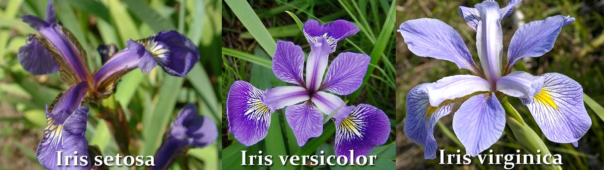

# Iris Classification Project

This project is focused on building a web application for Iris classification using Django, a high-level Python web framework. The application utilizes machine learning algorithms to classify Iris flowers based on their sepal and petal dimensions.



## About the Application
The application allows users to input sepal and petal dimensions of an Iris flower and predicts its class using the KNeighboursClassifier algorithm. The front-end is designed using Bootstrap CSS for responsiveness.


## PROJECT STRUCTURES

``` python

iris/
│
├── iris/  # Django project directory
│
├── irisApp/  # Django app directory
│   ├── templates/irisApp/  # HTML templates for the app
│   │   ├── layout.html  # Base layout template
│   │   └── index.html  # Home page template
│   │
│   └── static/irisApp/  # Static files for the app
│       ├── index.js  # JavaScript file for front-end logic
│       └── styles.css  # CSS file for styling
│
├── manage.py  # Django management script
├── requirements.txt  # Python dependencies
├── README.md  # Project documentation (this file)
├── .gitignore  # Git ignore file
└── LICENSE  # Project license
```

## SETUP
1. Clone this repository to your local machine.
2. Navigate to the project directory.
3. Create a virtual environment and activate it.
4. Install the required dependencies using.
``` bash 
pip install -r requirements.txt
```
5. run the classification file in `irisClassification.py` using this command:
``` bash 
cd irisApp
```
``` bash
python irisClassification.py
```

6. go back to your iris project using:
```bash 
cd ..
```

7. Make Migrations to establish your models in irisApp app using this command:
``` bash 
python manage.py makemigrations irisApp
```

8. Migrate using :
```bash 
 python manage.py migrate
 ```

9. Run the Django development server using:
``` bash
 python manage.py runserver
 ```

## USAGE
1. Access the web application at http://localhost:8000/ in your browser.
2. Follow the instructions on the homepage to classify Iris dataset samples.

## DEPENDENCIES
1. Django 4.1
2. scikit-learn (for KNeighbourClassifier)
3. Other dependencies listed in requirements.txt

## CREDIT
- This project utilizes the Iris dataset available in scikit-learn.


## LICENSE
[LICENSE](LICENSE)
